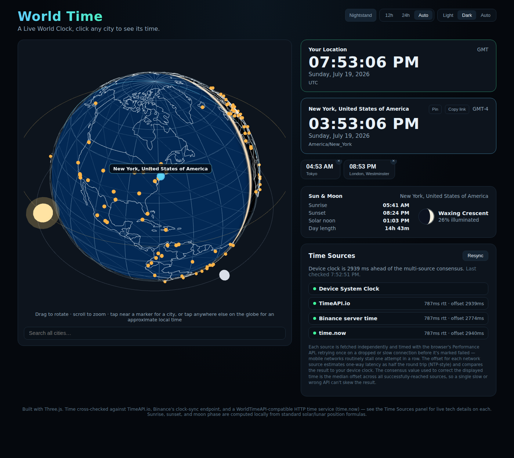
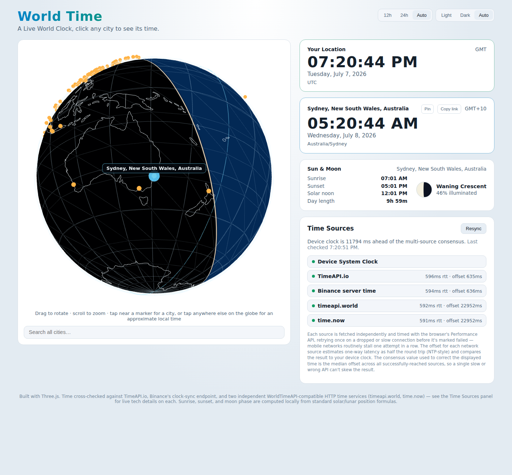
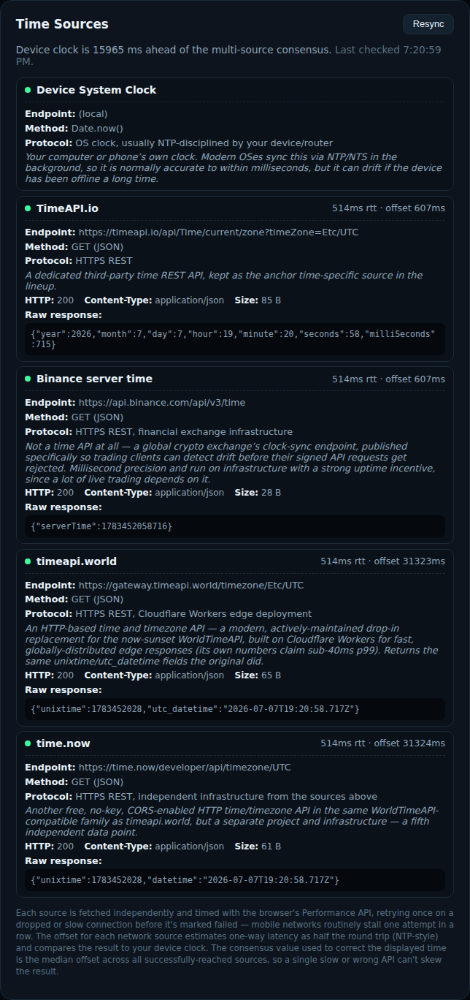
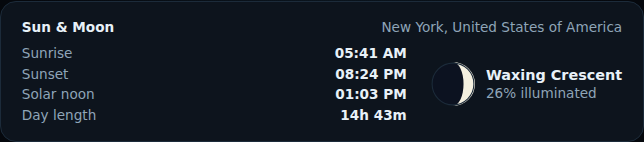

# World Time

A live world clock with a wireframe 3D globe — click any city to see its time, watch real day/night move across the Earth, and cross-check the displayed time against several independent public time sources.

**Live site:** https://defsix.github.io/time/



## What it does

- **Wireframe globe.** A Three.js globe with a lat/lon graticule, country border outlines, and a real day/night terminator computed from the actual subsolar point — no glow-band fudging, just a clean sharp line that tracks the real sun as the globe rotates.
- **~250 clickable cities**, plus a search box covering roughly 7,300 more. Click or tap near a marker (a generous invisible hit area makes this easy on touchscreens) to fly the camera there and see its local time.
- **Nearest-city default.** On load, if you allow location access, the app finds and flies to your nearest known city automatically.
- **Pin cities** to a small live-ticking compare strip, so you can keep an eye on several time zones at once. Pins persist across reloads.
- **Shareable links.** Selecting a city updates the URL, so a link can be copied and shared to point straight at that city's time.
- **Idle behavior.** Leave the globe untouched for 10 seconds and it flies back to your own location; 5 seconds after that, it starts a slow one-revolution-per-minute auto-spin. Any interaction cancels and resets the countdown.
- **Multi-source time sync.** The displayed time is corrected using the median offset across several independent time APIs (see below), each shown with live tech details — endpoint, protocol, HTTP status, response size, timing, and raw response — so the "trust but verify" is actually verifiable.
- **Sun & Moon panel.** Sunrise, sunset, solar noon, and day length for the selected city (computed client-side via the standard sunrise equation, correctly handling polar day/night), plus the current moon phase with a hand-drawn phase icon — no network dependency for any of it.
- **Light / dark / auto theme**, and a **12h / 24h / auto** time format toggle, both persisted.

## Time sources

Rather than trusting a single API, the site independently queries several time services, estimates each one's clock offset from the device's using an NTP-style midpoint calculation, and uses the **median** offset across all successfully-reached sources to correct the displayed time — so one slow or wrong API can't skew the result.

| Source | What it actually is |
|---|---|
| Device System Clock | Your OS's own clock (usually NTP-disciplined already) |
| [TimeAPI.io](https://timeapi.io/) | A dedicated time REST API |
| [Binance](https://binance-docs.github.io/apidocs/spot/en/#check-server-time) server time | A crypto exchange's clock-sync endpoint, published so trading clients can detect drift |
| [timeapi.world](https://timeapi.world/) | A modern, Cloudflare Workers-based replacement for the now-sunset WorldTimeAPI |
| [time.now](https://time.now/developer) | An independent WorldTimeAPI-compatible time service |

Note: real NTP servers (`pool.ntp.org`, `time.windows.com`, etc.) are deliberately **not** in this list — NTP runs over raw UDP, and browsers have no UDP socket API. There's no client-side way around that; using genuine NTP data here would require a server-side proxy that speaks NTP and re-exposes it over HTTPS.

## Tech stack

- [React](https://react.dev/) + [TypeScript](https://www.typescriptlang.org/), built with [Vite](https://vite.dev/)
- [Three.js](https://threejs.org/) for the globe (custom shader for the day/night terminator, hand-derived great-circle camera animation, world-atlas country border data)
- No backend — a static site deployed to [GitHub Pages](https://pages.github.com/) via GitHub Actions
- `city-timezones` (bundled, code-split) for the ~7,300-city search index

## Mobile apps

Both wrap this web app in a native WebView rather than reimplementing the
globe/clock/search natively, so they stay in sync with the web app
automatically:

- [`android/`](android/) — Kotlin, `WebView` + `WebViewAssetLoader`. See
  [`android/README.md`](android/README.md). Latest debug APK:
  <https://github.com/defsix/time/releases/download/android-debug-latest/app-debug.apk>
- [`ios/`](ios/) — Swift/SwiftUI, `WKWebView` + a custom `app://` scheme
  handler and a CoreLocation-backed geolocation bridge. See
  [`ios/README.md`](ios/README.md).

## Getting started

```bash
npm install
npm run dev      # start the dev server
npm run build    # type-check + production build to dist/
npm run preview  # preview the production build locally
```

Pushing to `main` automatically builds and deploys to GitHub Pages via `.github/workflows/deploy-pages.yml`.

## Screenshots

<details>
<summary>Light theme</summary>



</details>

<details>
<summary>Time Sources panel, expanded</summary>



</details>

<details>
<summary>Sun & Moon panel</summary>



</details>

## Changelog

### 2026-07-08

- Fixed the Android app failing to load at all (`net::ERR_NAME_NOT_RESOLVED`) — it was loading `https://appassets.androidx.net/...`, but `WebViewAssetLoader`'s real default domain is `appassets.androidplatform.net`, so every request missed the interceptor and fell through to a real (failing) DNS lookup
- The Android CI workflow now also republishes the debug APK to a rolling `android-debug-latest` GitHub Release on every push to `main`, giving a stable download URL that doesn't expire (unlike per-run workflow artifacts)

### 2026-07-07

- Added Kotlin Android (`WebView` + `WebViewAssetLoader`) and Swift/SwiftUI iOS (`WKWebView` + a custom `app://` scheme handler and CoreLocation geolocation bridge) apps that wrap this web app natively — see [Mobile apps](#mobile-apps)
- Added a GitHub Actions workflow (`.github/workflows/android-build.yml`) that builds a debug `.apk` on every push/PR touching the app and uploads it as a downloadable artifact
- Added a GitHub Actions workflow (`.github/workflows/ios-build.yml`) that builds an unsigned iOS Simulator app on every push/PR touching the app and uploads it as a downloadable artifact (a real device `.ipa` needs an Apple Developer signing certificate this repo doesn't have configured)
- Replaced Coinbase, Kraken, and KuCoin (all failed CORS in real-world testing) with timeapi.world and time.now; documented why real NTP servers can't be queried from a browser at all (UDP-only protocol, no browser socket API)
- Swapped WorldTimeAPI and two hobby-run ISS-tracker sources for exchange clock-sync endpoints after field reports of consistent failures
- Added idle behavior: return to your location after 10s idle, then a slow 1-rev/min auto-spin after 15s
- Added a fifth time source and a client-side Sun & Moon panel (sunrise/sunset/solar noon/day length, moon phase with a hand-derived SVG icon), verified against known reference dates
- Added favicon and Open Graph/Twitter preview image, shareable city links, 12h/24h toggle, city pinning with a compare strip, and a much larger invisible tap target on markers for touch accuracy
- Code-split the ~2MB city dataset so it only loads when search or nearest-city lookup actually needs it, roughly halving the initial JS payload
- Enriched the Time Sources panel with HTTP status, content type, response size, and best-effort connection timing breakdown
- Retried failed time source requests once and raised the timeout, after field data showed real mobile networks stalling single attempts
- Expanded the globe from ~36 to ~250 city markers
- Reduced globe drag/zoom sensitivity for finer control
- Replaced the day/night terminator's soft glow with a clean, sharp single line

### 2026-07-06

- Fixed a bug where the day/night terminator rotated with the camera instead of staying fixed to the real geography (a view-space vs. world-space shader bug)
- Made the globe's wireframe/border colors theme-independent, fixing invisible country borders in light mode
- Added country border outlines, camera fly-to animation with on-globe name labels, and a full ~7,300-city search index with nearest-city lookup
- Set up automatic deployment to GitHub Pages
- Initial build: wireframe globe with a lat/lon graticule and day/night shading, ~36 clickable cities, a live clock corrected against multiple time sources, and a light/dark theme toggle
