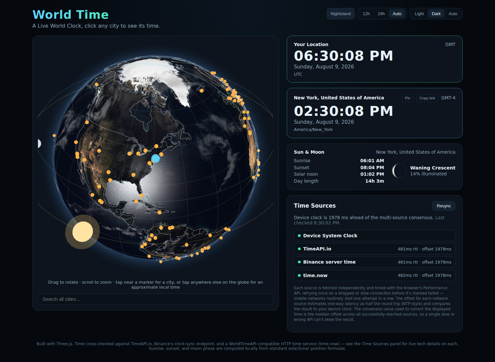
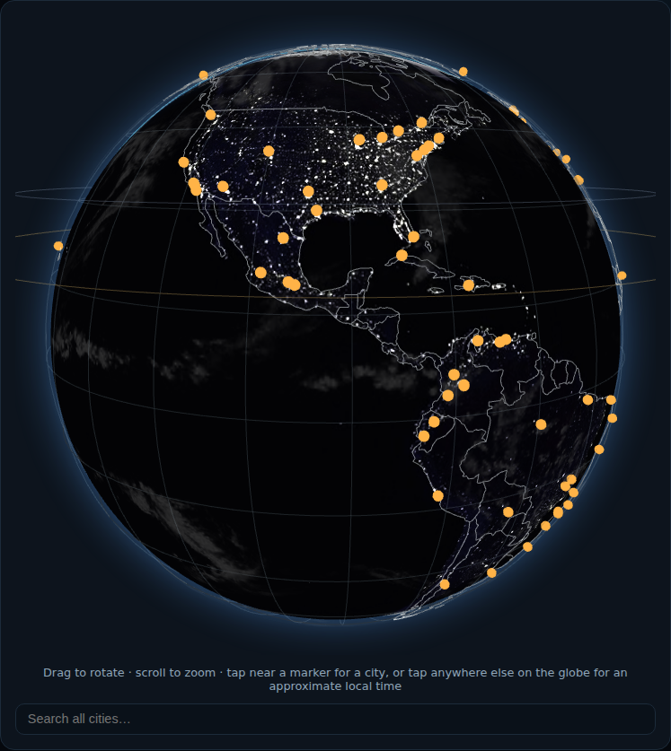
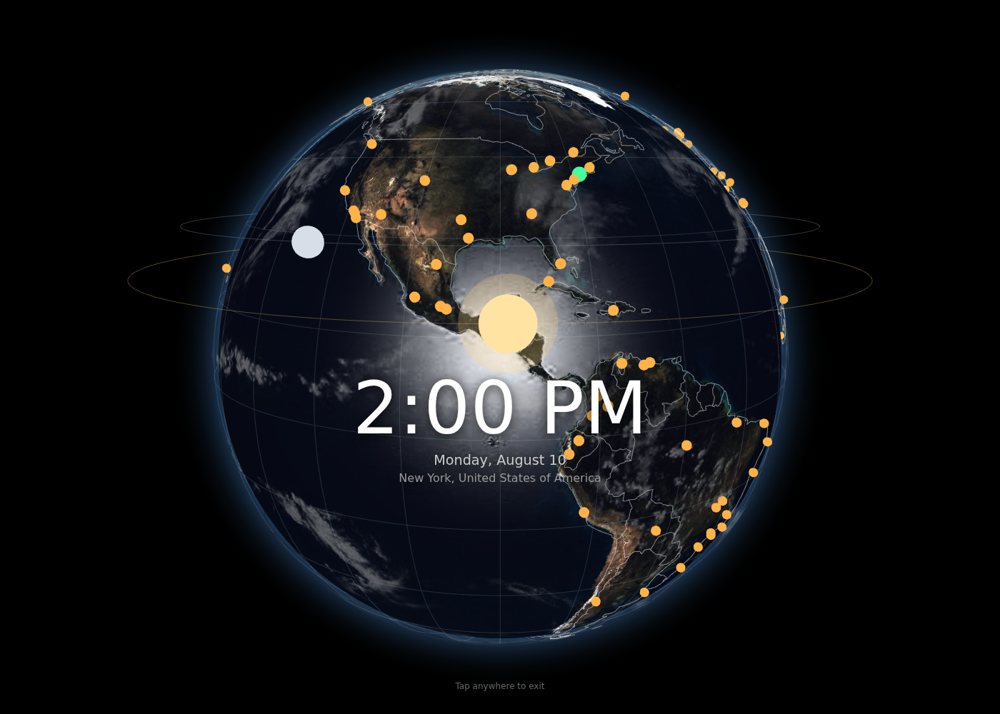
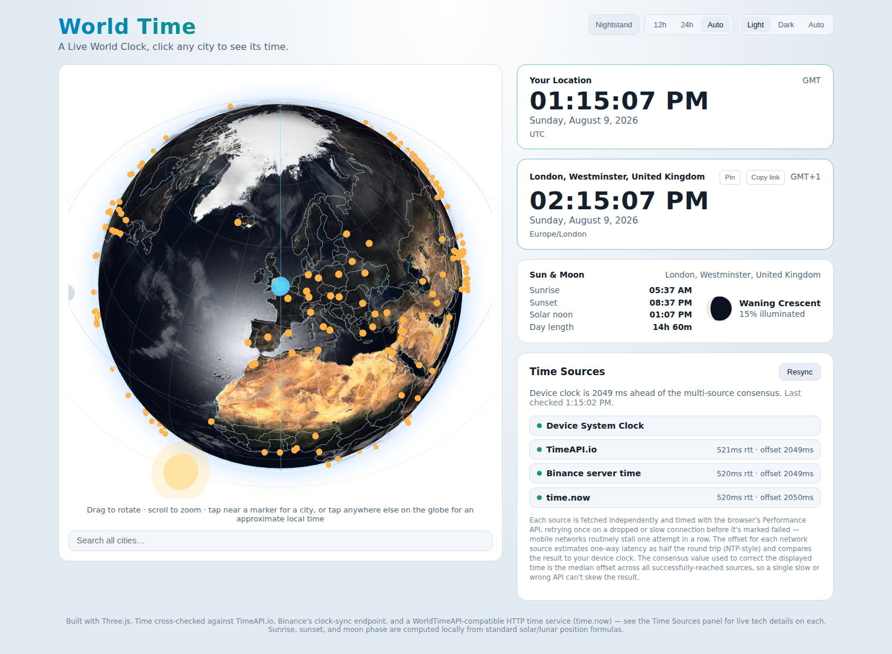
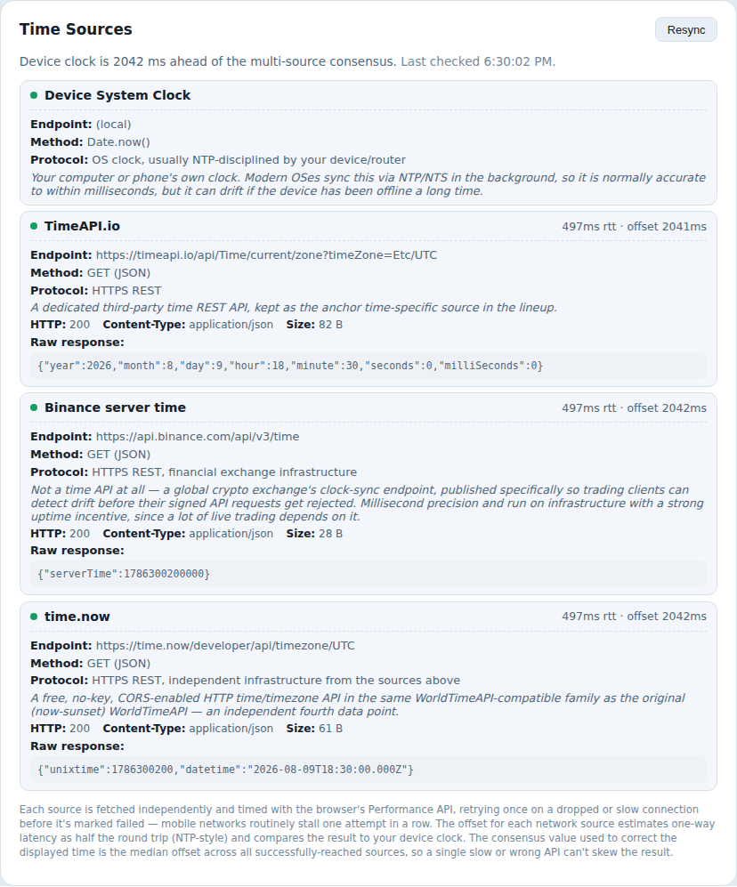
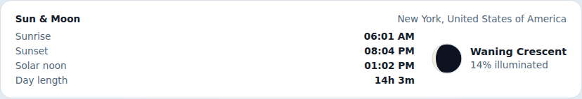

# World Time

A live world clock with a photorealistic 3D globe — click any city to see its time, watch real day/night move across the Earth, and cross-check the displayed time against several independent public time sources.

**Live site:** https://defsix.github.io/time/



## What it does

- **Photorealistic globe.** A Three.js globe rendered with real satellite imagery, GPU terrain-relief shading, an ocean specular highlight, drifting clouds, and city lights on the night side — plus a lat/lon graticule and country border outlines, and a real day/night terminator computed from the actual subsolar point that tracks the real sun as the globe rotates.
- **Live sun & moon markers.** Small markers orbiting the globe show where the sun and moon are actually overhead right now, each trailed by a thin ring tracing the path it sweeps as the day (or lunar day) progresses — real right ascension/declination math (a Meeus low-precision lunar position series for the moon), not just a decorative motif.
- **~250 clickable cities**, plus a search box covering roughly 7,300 more. Click or tap near a marker (a generous invisible hit area makes this easy on touchscreens) to fly the camera there and see its local time.
- **Nearest-city default.** On load, if you allow location access, the app finds and flies to your nearest known city automatically.
- **Pin cities** to a small live-ticking compare strip, so you can keep an eye on several time zones at once. Pins persist across reloads.
- **Shareable links.** Selecting a city updates the URL, so a link can be copied and shared to point straight at that city's time.
- **Idle behavior.** Leave the globe untouched for 10 seconds and it flies back to your own location; 5 seconds after that, it starts a slow one-revolution-per-minute auto-spin. Any interaction cancels and resets the countdown.
- **Multi-source time sync.** The displayed time is corrected using the median offset across several independent time APIs (see below), each shown with live tech details — endpoint, protocol, HTTP status, response size, timing, and raw response — so the "trust but verify" is actually verifiable.
- **Sun & Moon panel.** Sunrise, sunset, solar noon, and day length for the selected city (computed client-side via the standard sunrise equation, correctly handling polar day/night), plus the current moon phase with a hand-drawn phase icon — no network dependency for any of it.
- **Light / dark / auto theme**, and a **12h / 24h / auto** time format toggle, both persisted.
- **Multilingual UI.** The app automatically follows your device/browser language — English, Spanish, French, German, Portuguese, Japanese, Simplified Chinese, Polish, Russian, and Czech are all fully translated (dates and times use your locale's own conventions too), with a plain-English fallback for anything else.

## The globe

The core sphere is rendered with real NASA-sourced imagery rather than flat colors — the same day/night/terrain/cloud texture set bundled with three.js's own official examples:

- **Day side** — true-color satellite imagery, lit per-pixel from the real subsolar direction (not the fixed light rig Three.js normally uses), with a mild gamma lift so oceans and forests read as vivid rather than the muted true-color tone the raw imagery has at full daylight.
- **Terrain relief** — a tangent-space normal map perturbs the lighting normal so mountain ranges actually catch and fall away from the light directionally. The tangent basis is reconstructed on the fly from screen-space derivatives (no precomputed vertex tangents needed), which gets numerically unstable at the sphere's grazing silhouette — so relief is applied as a small *bounded correction* on top of the always-stable flat-normal lighting, rather than driving brightness on its own. (Chasing this down was the interesting bug of the whole feature: without the bound, the instability was darkening a much wider band near the limb than the real day/night terminator ever does.)
- **Ocean specular** — a land/water mask drives a Blinn-Phong highlight so oceans shine near the subsolar point and land doesn't, faded out near the limb for the same stability reason as the relief shading.
- **Night side** — real city lights, blended in via the same real subsolar direction that drives the (unchanged, geography-accurate) day/night terminator.
- **Clouds** — a separate, semi-transparent shell drifting slowly and independently of the camera-driven globe orientation, lit by an actual `DirectionalLight` positioned at the live sun direction each frame.
- **Atmosphere** — a backside-rendered, additively-blended Fresnel glow shell that brightens toward the limb, replacing what used to be a faint wireframe "shell" mesh.

<p align="center">
  
  
</p>

## Time sources

Rather than trusting a single API, the site independently queries several time services, estimates each one's clock offset from the device's using an NTP-style midpoint calculation, and uses the **median** offset across all successfully-reached sources to correct the displayed time — so one slow or wrong API can't skew the result.

| Source | What it actually is |
|---|---|
| Device System Clock | Your OS's own clock (usually NTP-disciplined already) |
| [TimeAPI.io](https://timeapi.io/) | A dedicated time REST API |
| [Binance](https://binance-docs.github.io/apidocs/spot/en/#check-server-time) server time | A crypto exchange's clock-sync endpoint, published so trading clients can detect drift |
| [time.now](https://time.now/developer) | A WorldTimeAPI-compatible time service |

Note: real NTP servers (`pool.ntp.org`, `time.windows.com`, etc.) are deliberately **not** in this list — NTP runs over raw UDP, and browsers have no UDP socket API. There's no client-side way around that; using genuine NTP data here would require a server-side proxy that speaks NTP and re-exposes it over HTTPS.

## Tech stack

- [React](https://react.dev/) + [TypeScript](https://www.typescriptlang.org/), built with [Vite](https://vite.dev/)
- [Three.js](https://threejs.org/) for the globe (custom shader for the photoreal day/night terminator, terrain relief and ocean specular, hand-derived great-circle camera animation, world-atlas country border data). Earth/cloud textures are the same NASA-sourced imagery bundled with three.js's own official examples.
- No backend — a static site deployed to [GitHub Pages](https://pages.github.com/) via GitHub Actions
- `city-timezones` (bundled, code-split) for the ~7,300-city search index

## Mobile apps

Both wrap this web app in a native WebView rather than reimplementing the
globe/clock/search natively, so they stay in sync with the web app
automatically:

- [`android/`](android/) — Kotlin, `WebView` + `WebViewAssetLoader`, with
  city alarms and a Nightstand/bedside clock mode. See
  [`android/README.md`](android/README.md).
  **Signed release (recommended):**
  <https://github.com/defsix/time/releases/latest> — the actual
  distribution build, sideload it directly.
  [Latest debug build](https://github.com/defsix/time/releases/download/android-debug-latest/app-debug.apk)
  is also available (rebuilt on every push to `main`), useful for testing
  in-progress changes but not signed for real use.
- [`ios/`](ios/) — Swift/SwiftUI, `WKWebView` + a custom `app://` scheme
  handler, a CoreLocation-backed geolocation bridge, and the same city
  alarms / Nightstand mode as Android (backed by local notifications
  instead of `AlarmManager`). See [`ios/README.md`](ios/README.md).

## Getting started

```bash
npm install
npm run dev      # start the dev server
npm run build    # type-check + production build to dist/
npm run preview  # preview the production build locally
```

Pushing to `main` automatically builds and deploys to GitHub Pages via `.github/workflows/deploy-pages.yml`.

## Screenshots

<details>
<summary>Light theme</summary>



</details>

<details>
<summary>Time Sources panel, expanded</summary>



</details>

<details>
<summary>Sun & Moon panel</summary>



</details>

## Changelog

### 2026-08-19

- Added an MIT `LICENSE` (root, `android/`, `ios/`) and set `"license": "MIT"` in `package.json` so license-detection tooling picks it up.

### 2026-08-10

- Bumped Android to `versionCode 5` / `versionName "1.4"` for the signed release build, to pick up the photorealistic globe below (v1.3 predates it).
- Expanded the README with a dedicated "The globe" section covering the new rendering pipeline in more depth, plus night-side city-lights and Nightstand mode screenshots.

### 2026-08-09

- **Upgraded the globe from flat wireframe shading to a photorealistic Earth.** Real day-side satellite imagery, GPU terrain-relief shading (a tangent-space normal map lighting mountain ranges), an ocean specular highlight, drifting clouds, and real city lights on the night side — the day/night terminator itself is unchanged (still the actual astronomical subsolar point), but everything it shades now looks like a real planet instead of a flat-colored sphere. The lat/lon graticule, time-zone meridians, and country border overlay are all still there, just dialed back slightly so they read as an overlay on real imagery rather than a wireframe. The old faint outer wireframe "shell" is replaced by a proper Fresnel atmosphere glow.

### 2026-08-05

- **The app is now multilingual.** The UI automatically follows your device/browser language, no settings to change — English, Spanish, French, German, Portuguese, Japanese, Simplified Chinese, Polish, Russian, and Czech are all fully translated: every panel, button, and label, including the Time Sources panel's detailed technical descriptions and the moon phase names. Falls back to English for any other language. Dates and times also follow your own locale's conventions (date order, month names, 12h/24h defaults), not just the translated language. Covers both the web app and the Android/iOS apps automatically, since they're WebView wrappers around the same web UI — no separate per-platform translation work. City/country names and the standalone privacy policy page are not translated (out of scope).
- Corrected a stale "What it does" bullet that still described the day/night terminator as a sharp line — it's been a soft gradient since the 2026-07-19 changes.
- Bumped to `versionCode 4` / `versionName "1.3"`, ready for a `v1.3` tag — the signed release build only runs on a version tag push, so `v1.2` predates (and doesn't include) the multilingual UI above.

### 2026-07-19

- Softened the day/night terminator into a graduated gradient (it was previously a very sharp line) and moved the globe's default resting camera position a little further out. Refreshed all the screenshots below to match the current app (sun/moon markers, softer terminator, updated Time Sources lineup).
- Removed the warm highlight band at the terminator crossover — it was reading as an odd golden line instead of a clean fade, so the day-blue now blends directly into the night-black. Refreshed the hero screenshots again to match.
- Bumped to `versionCode 3` / `versionName "1.2"`, ready for a `v1.2` tag.
- Added live sun and moon markers orbiting the globe, each with a thin ring tracing its current path — real position math (right ascension/declination via Greenwich Mean Sidereal Time, with a Meeus low-precision lunar position series for the moon), not a decorative approximation. Also upgraded the day/night terminator's own subsolar-point calculation to the same rigor (previously a cruder day-of-year approximation), correcting it by the equation of time.
- Tapping the sun or moon marker now shows a name label, tracking the marker's own position as it moves. Also made both markers a little bigger and moved them a bit further out from the globe surface.
- Bumped to `versionCode 2` / `versionName "1.1"`, ready for a `v1.1` tag — Android requires a strictly increasing `versionCode` for a release to install as an update over an existing one, so `v1.0` itself couldn't just be re-tagged with new content.
- Cut the first tagged release (`v1.0`) via the signed-APK release workflow.
- Renamed the release APK from AGP's generic default (`app-release.apk`) to `world-time-v<versionName>.apk`, so downloads from different releases don't collide/overwrite each other in the same folder. CI now matches the release output by glob rather than a hardcoded filename.
- Pointed the [Mobile apps](#mobile-apps) section at the actual signed release (`releases/latest`) instead of only the unsigned rolling debug build.

### 2026-07-12

- Android release builds now produce a signed `.apk` instead of a `.aab` — World Time is distributed only via GitHub Releases, not the Play Store, so the App Bundle format was dead weight. Pushing a `v*` tag now builds the signed release APK and publishes it (with a `.sha256` checksum) to a matching GitHub Release; the workflow refuses to publish a tagged release at all if the signing secrets aren't set, rather than silently shipping a debug-signed APK as "the" release.
- Reverted the Daydream/screen saver feature added earlier today — after installing it, the Android app started showing a blank white screen on every launch (not specific to using the screensaver itself, and not fixed by clearing app storage). Rolled back to isolate whether the regression was actually in that change or in the prior (2026-07-09) release, before rebuilding the feature more carefully.
- Set the Android WebView's cache mode to `LOAD_NO_CACHE` for the bundled app assets — they're read straight out of the APK, not fetched over a real network, so there's no cost to skipping the HTTP cache, and it removes one possible way a stale cached page could survive an in-place app update.

### 2026-07-09

- Brought the iOS app to feature parity with Android: city alarms (backed by local notifications instead of `AlarmManager`, since iOS has no third-party-accessible exact-alarm scheduling API) and Nightstand mode (keep-awake via `UIApplication.isIdleTimerDisabled`, status bar icon color matching the web app's own theme via a new status-bar-aware view controller)
- Generalized `src/lib/androidBridge.ts` into `src/lib/nativeBridge.ts`: every call is now Promise-based so the same web-side code drives both Android's synchronous `addJavascriptInterface` bridge and iOS's new async `WKScriptMessageHandler`-based one
- Android: release build type is now R8-minified, with a signing config that reads from an optional `keystore.properties` file or `ANDROID_KEYSTORE_*` CI secrets (falling back to debug signing when neither is configured); the CI workflow now also builds a `bundleRelease` `.aab` on every push/PR, ready for Play Console upload once a real release keystore is added
- Added a static privacy policy page (`public/privacy.html`, deployed at `/privacy.html`) for the Play Store / App Store submission flows, since both apps request location and (mobile-only) notification permissions — states plainly that there's no logging or storage beyond the bare minimum a feature needs (kept on-device only), and spells out the specific reason location is requested
- Removed timeapi.world as a time source — it was failing consistently in the field; down to Device Clock, TimeAPI.io, Binance, and time.now
- Tapping a point on the globe with no known city now shows the same cyan highlight marker and a coordinate label as selecting a city does, instead of no visual indicator at all — also restored correctly when reopening a shared link that points at a raw coordinate rather than a city

### 2026-07-08

- Fixed the Android app showing a white bar at the top in dark theme / Nightstand mode — status bar color previously only tracked the *device's* system dark/light mode, not the web app's own theme; the app is now edge-to-edge with the status bar icon color set dynamically to match what's actually on screen
- Fixed the city alarm popover overflowing off the left edge of the screen on narrow phones — it now positions itself from the toggle button's actual measured location, clamped to the viewport
- The Alarm button is now also available on the "Your Location" card, for setting an alarm in your own local time zone (previously only available for a selected city)
- Nightstand mode now shows the globe full-bleed in the background, slowly auto-rotating at one revolution per 10 minutes, with local time, pinned cities' times, and any pending alarms overlaid on top
- Added city alarms to the Android app: set an alarm for a specific time in whichever city you're viewing (e.g. "ring at 7:00 AM in Tokyo"), backed by `AlarmManager.setAlarmClock()` with a graceful inexact-window fallback, a full-screen ringing activity, and reboot-survival
- Added Nightstand mode to the Android app: a full-screen dimmed clock that keeps the screen on (Web Wake Lock API + a native fallback), for propping the phone up overnight
- Fixed the Android app failing to load at all (`net::ERR_NAME_NOT_RESOLVED`) — it was loading `https://appassets.androidx.net/...`, but `WebViewAssetLoader`'s real default domain is `appassets.androidplatform.net`, so every request missed the interceptor and fell through to a real (failing) DNS lookup
- The Android CI workflow now also republishes the debug APK to a rolling `android-debug-latest` GitHub Release on every push to `main`, giving a stable download URL that doesn't expire (unlike per-run workflow artifacts)

### 2026-07-07

- Added Kotlin Android (`WebView` + `WebViewAssetLoader`) and Swift/SwiftUI iOS (`WKWebView` + a custom `app://` scheme handler and CoreLocation geolocation bridge) apps that wrap this web app natively — see [Mobile apps](#mobile-apps)
- Added a GitHub Actions workflow (`.github/workflows/android-build.yml`) that builds a debug `.apk` on every push/PR touching the app and uploads it as a downloadable artifact
- Added a GitHub Actions workflow (`.github/workflows/ios-build.yml`) that builds an unsigned iOS Simulator app on every push/PR touching the app and uploads it as a downloadable artifact (a real device `.ipa` needs an Apple Developer signing certificate this repo doesn't have configured)
- Replaced Coinbase, Kraken, and KuCoin (all failed CORS in real-world testing) with timeapi.world and time.now; documented why real NTP servers can't be queried from a browser at all (UDP-only protocol, no browser socket API)
- Swapped WorldTimeAPI and two hobby-run ISS-tracker sources for exchange clock-sync endpoints after field reports of consistent failures
- Added idle behavior: return to your location after 10s idle, then a slow 1-rev/min auto-spin after 15s
- Added a fifth time source and a client-side Sun & Moon panel (sunrise/sunset/solar noon/day length, moon phase with a hand-derived SVG icon), verified against known reference dates
- Added favicon and Open Graph/Twitter preview image, shareable city links, 12h/24h toggle, city pinning with a compare strip, and a much larger invisible tap target on markers for touch accuracy
- Code-split the ~2MB city dataset so it only loads when search or nearest-city lookup actually needs it, roughly halving the initial JS payload
- Enriched the Time Sources panel with HTTP status, content type, response size, and best-effort connection timing breakdown
- Retried failed time source requests once and raised the timeout, after field data showed real mobile networks stalling single attempts
- Expanded the globe from ~36 to ~250 city markers
- Reduced globe drag/zoom sensitivity for finer control
- Replaced the day/night terminator's soft glow with a clean, sharp single line

### 2026-07-06

- Fixed a bug where the day/night terminator rotated with the camera instead of staying fixed to the real geography (a view-space vs. world-space shader bug)
- Made the globe's wireframe/border colors theme-independent, fixing invisible country borders in light mode
- Added country border outlines, camera fly-to animation with on-globe name labels, and a full ~7,300-city search index with nearest-city lookup
- Set up automatic deployment to GitHub Pages
- Initial build: wireframe globe with a lat/lon graticule and day/night shading, ~36 clickable cities, a live clock corrected against multiple time sources, and a light/dark theme toggle
